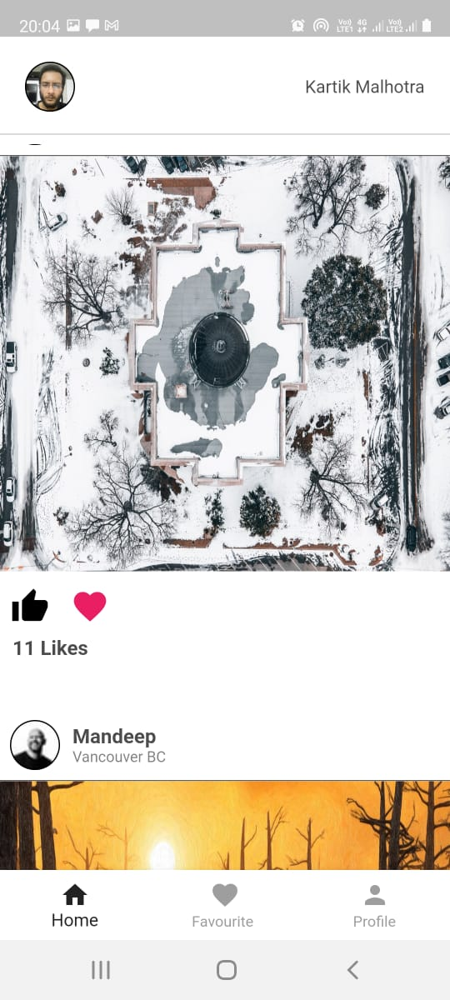
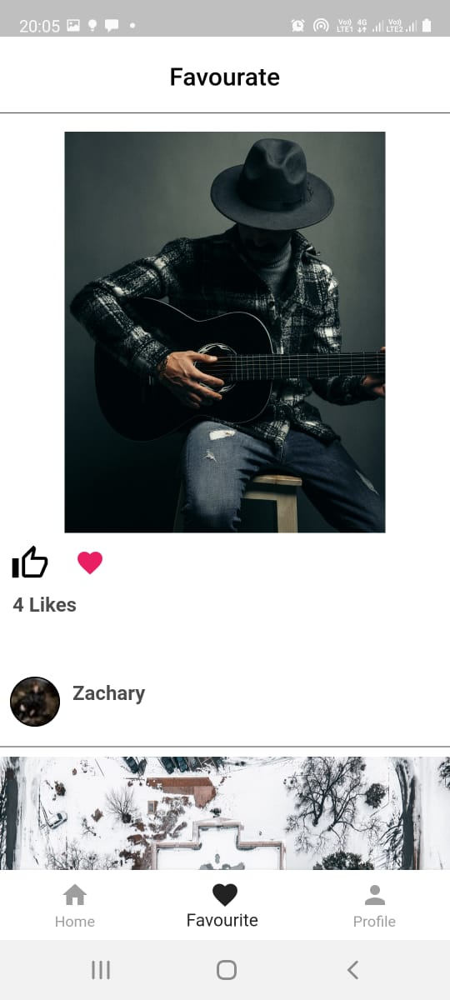
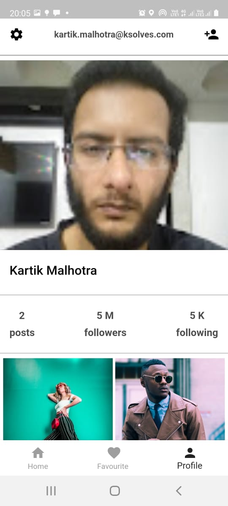
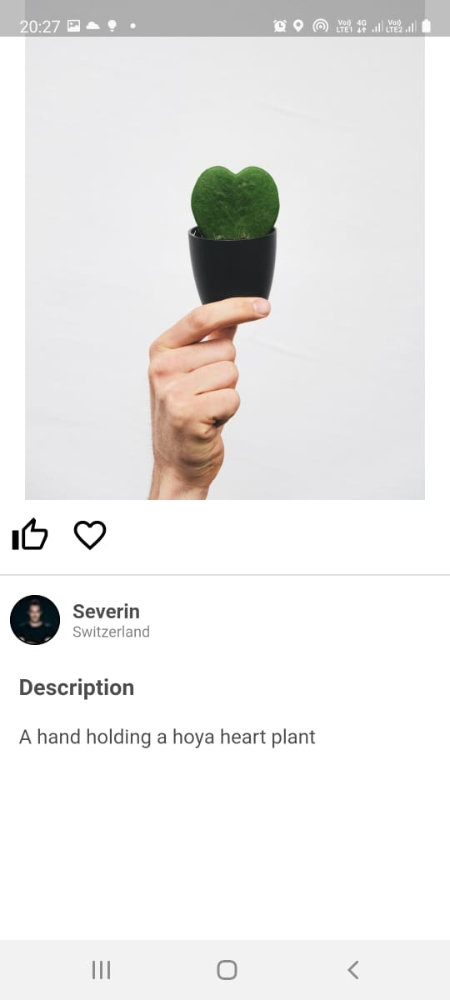

# Interview Task
=======
# Dataviv Technologies

## Screenshots 

<table>
  <tr>
     <td>Home Tab</td>
     <td>Favourate Tab</td>
     <td>Profile Tab</td>
  </tr>
  <tr>
    <td></td>
    <td></td>
    <td> </td>
  </tr>
  <tr>
     <td>Description Screen</td>
     <td>SignIn Screen</td>
  </tr>
  <tr>
    <td></td>
    <td></td>
  </tr>
 </table>

## Getting Started

- [Lab: Write your first Flutter app](https://flutter.dev/docs/get-started/codelab)
- [Cookbook: Useful Flutter samples](https://flutter.dev/docs/cookbook)

For help getting started with Flutter, view our
[online documentation](https://flutter.dev/docs), which offers tutorials,
samples, guidance on mobile development, and a full API reference.

